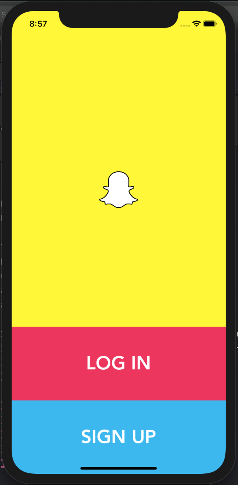
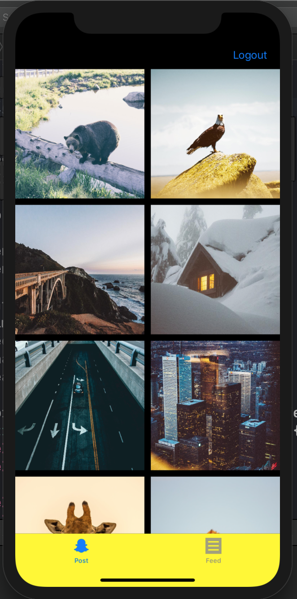
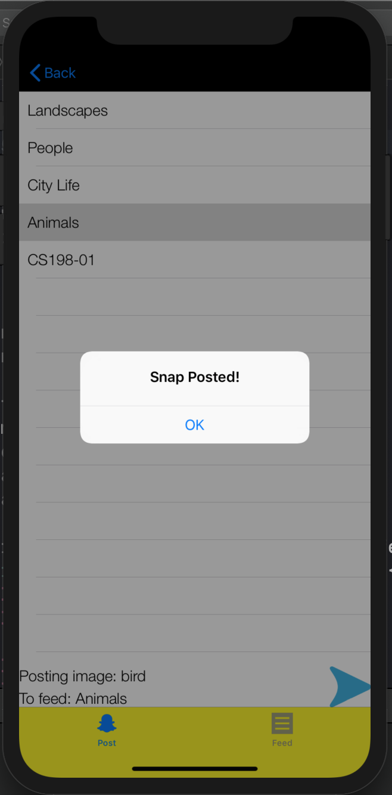
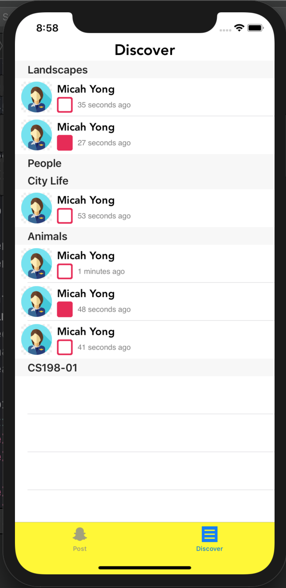

# Snapchat #

Snapchat is a multimedia messaging app used globally, created by Evan Spiegel, Bobby Murphy, and Reggie Brown, former students at Stanford University, and developed by Snap Inc., originally Snapchat Inc.

This is a low-grade version of Snapchat **designed for educational purposes** with functionality and design modeled from the original Snapchat. 

## Motivation ##

The motive behind this project was to take a successful and complex social media platform, then rebuild and maintain it from the ground up in order to learn the fundamentals behind designing a social media app like Snapchat. The source code in this project was written in a well-documented fashion with the intention that it would be viewed by others. 

## Build Status ##

The project is at it's state before Firebase authentication. All fundamental UI elements and controllers have been implemented and primed for the main goal of connecting the replica to an online database. Currently, this app successfully uploads photos to a local Snapchat feed whenever the app runs. 

## Screenshots ##

## Technology and frameworks used ##

**Built with**
  * Swift 4.0
  * XCode 10.1
  * CocoaPods
  * [Firebase](https://console.firebase.google.com/u/0/ "Google's Firebase")
  
## Installation ## 

1. Download the zip file in the repo labeled "Snapchat.zip".
2. Unzip the file, then open Snapchat.xcodeproj on XCode.
3. Select which simulator you'd like to run the application on in the top left corner of XCode. 
4. Build and run simulator.

## How To Use ## 

1. Login functionality has not yet been implemented, so tapping the "LOG IN" button directs you to the image picker. 
2. Select the image you'd like the send/post. 
3. Select which feed/person you'd like to post to. 
4. Hit the blue send button. 
  1. Send as many pictures as you want. 
5. Navigate to the feed discovery page by clicking the bottom right tab. It should be labelled "Feed". 
6. Tap on the photo you'd like to view, and an image view should appear. 
7. Repeat until satisfied. 

## Contribute ## 

Once this project finishes entirely, I'd like to create a YouTube series on how you can implement it yourself. If this is something that might interest you, email me at micahtyong@berkeley.com !

## Credits ## 

Initial project idea and spec credits go to Berkeley's iOS Decal 2019. 
Project idea is entirely inspired by Snap Inc's Snapchat. All idea and intellectual property rights go to Snap Inc. 
 
